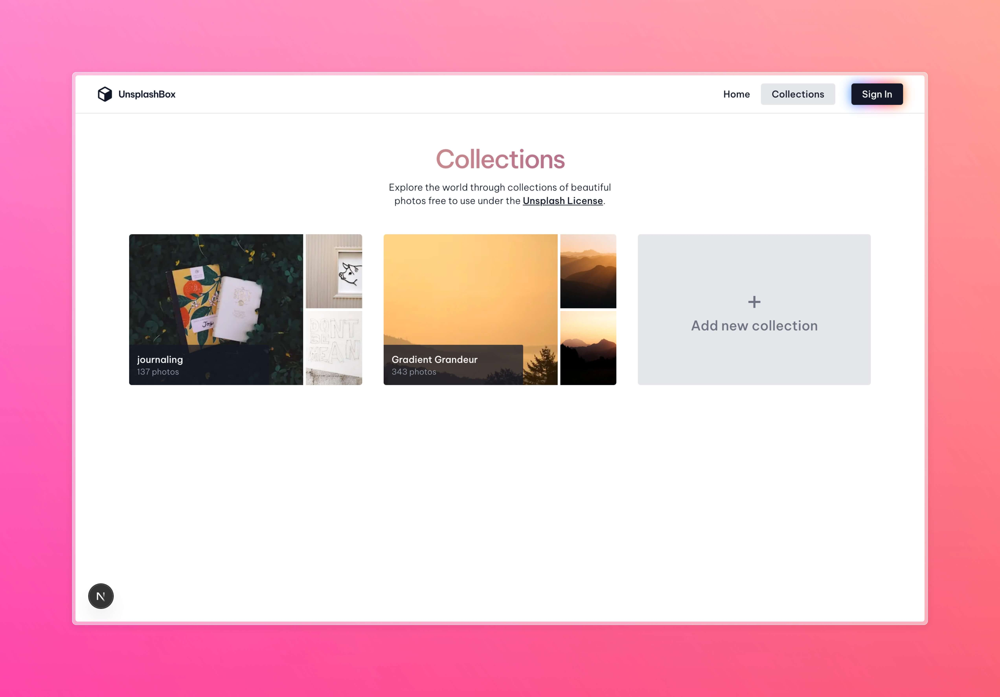

# UNSPLASH BOX

**Link:** https://unsplashbox.vercel.app



## Project Purpose

A full-stack image discovery and curation application demonstrating integration with the Unsplash API and robust collection management features. The project focuses on providing a seamless user experience for searching, organizing, and managing high-quality images using modern web technologies.

## Tech Stack

-  **Frontend:** Next.js (App Router), TypeScript, Tailwind CSS
-  **State Management:** TanStack React Query
-  **Forms & Validation:** React Hook Form, Zod
-  **Authentication:** Clerk
-  **Backend:** Next.js Server Actions & API Routes
-  **Database:** Prisma ORM with PostgreSQL
-  **Image Source:** Unsplash API
-  **Deployment:** Vercel

## Key Features

### Image Discovery & Search

-  Search Unsplash images with pagination.
-  View detailed image information (author, date, etc.).
-  Download high-resolution images directly.
-  Responsive masonry grid display.

### Collection Management (Authenticated Users)

-  Create new collections with unique names.
-  Edit collection names.
-  Delete collections (cascades image relationship, cleans up unused images).
-  Add images to one or more collections.
-  Remove images from collections.
-  View personal collections and the images within them.

### User Authentication

-  Secure Sign-in/Sign-up via Clerk.
-  Protected routes and actions for authenticated users.
-  User data synchronization via Clerk Webhooks.

## Technical Features

-  **Server Actions:** Securely handle all database mutations (CRUD operations for collections and image relations).
-  **React Query:** Efficient client-side data fetching, caching, and state synchronization.
-  **Form Validation:** Robust client and server-side validation using Zod and React Hook Form.
-  **Responsive Design:** Adapts seamlessly to various screen sizes using Tailwind CSS.
-  **Type Safety:** End-to-end type safety with TypeScript and Prisma.
-  **API Integration:** Fetches data directly from the Unsplash API.
-  **Database Relations:** Manages complex many-to-many relationships between Images and Collections.
-  **Loading States:** Utilizes React Suspense for smooth loading experiences.
-  **Notifications:** Provides user feedback via Sonner toasts.

## Development Process

1. **Initial Setup**

-  Next.js app scaffolding.
-  Prisma ORM configuration with PostgreSQL database.
-  Tailwind CSS setup and configuration.
-  Clerk integration for authentication.

2. **Core Implementation**

-  Defined database models (User, Collection, Image, ImagesInCollections).
-  Implemented Server Actions for all CRUD operations.
-  Integrated Unsplash API fetching logic.
-  Defined application routes using the Next.js App Router.
-  Set up TanStack Query for client-state management.
-  Built UI components.

3. **UI/UX Enhancements**

-  Implemented responsive layouts.
-  Added loading indicators and Suspense boundaries.
-  Integrated Sonner for toast notifications on actions.
-  Used Motion One for subtle animations.

4. **Testing & Deployment**

-  Manual testing of search, authentication, and CRUD operations.
-  Vercel deployment configuration.
-  Vercel Analytics integration.

## How to Run Locally

```bash
git clone https://github.com/enggar77/unsplashBox.git
cd unsplashBox
npm install
npm run dev
```
